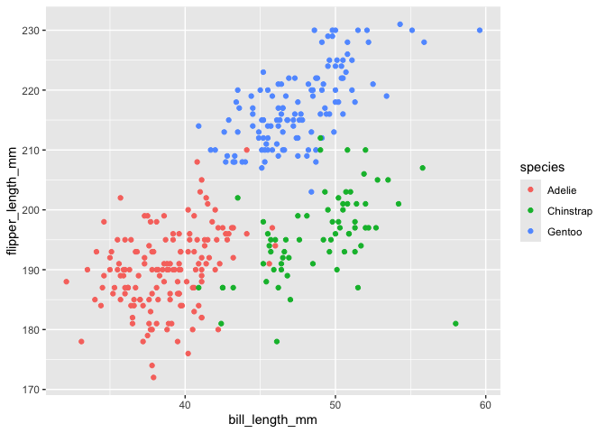

HW1 document
================

## Problem 1

``` r
data("penguins", package = "palmerpenguins")
```

## Description

This `penguins`dataset shows total collected 344 samples of penguins
from 2007 to 2009 with 3 different species across different locations.
This dataset also includes variables: `species`, `island`,
`bill_length_mm` and`bill_ depth_mm`, `flipper_length_mm`,
`body_mass_g`, `sex`, and `year`. There are total 334 `nrow` and total 8
`ncol`. The mean flipper length is 200.9152.

## Mean of flipper_length

``` r
library(tidyverse)
```

    ## ── Attaching core tidyverse packages ──────────────────────── tidyverse 2.0.0 ──
    ## ✔ dplyr     1.1.4     ✔ readr     2.1.5
    ## ✔ forcats   1.0.0     ✔ stringr   1.5.1
    ## ✔ ggplot2   3.5.1     ✔ tibble    3.2.1
    ## ✔ lubridate 1.9.3     ✔ tidyr     1.3.1
    ## ✔ purrr     1.0.2     
    ## ── Conflicts ────────────────────────────────────────── tidyverse_conflicts() ──
    ## ✖ dplyr::filter() masks stats::filter()
    ## ✖ dplyr::lag()    masks stats::lag()
    ## ℹ Use the conflicted package (<http://conflicted.r-lib.org/>) to force all conflicts to become errors

``` r
mean_flipper_length = mean(pull(penguins, flipper_length_mm), na.rm=TRUE)
mean_flipper_length
```

    ## [1] 200.9152

\##Scatterplot

``` r
library(ggplot2)
library(palmerpenguins)

# Load the penguins dataset
data("penguins")

# Create a scatterplot
ggplot(penguins, aes(x = bill_length_mm, y = flipper_length_mm, color = species)) + geom_point()
```

    ## Warning: Removed 2 rows containing missing values or values outside the scale range
    ## (`geom_point()`).

<!-- -->

## Save image

``` r
ggsave("penguins_scatterplot.png")
```

    ## Saving 7 x 5 in image

    ## Warning: Removed 2 rows containing missing values or values outside the scale range
    ## (`geom_point()`).

## Problem 2

``` r
library(tidyverse)
example_df = tibble (
  vec_number = rnorm(10),
  vec_logical = vec_number > 0,
  char_vec = c("1","2","3","4","5","6","7","8","9","10"),
  fact_vec = factor(sample(c("level1","level2","level3"),10, replace = TRUE)))
print(example_df)
```

    ## # A tibble: 10 × 4
    ##    vec_number vec_logical char_vec fact_vec
    ##         <dbl> <lgl>       <chr>    <fct>   
    ##  1     -1.42  FALSE       1        level2  
    ##  2      1.53  TRUE        2        level1  
    ##  3     -1.59  FALSE       3        level2  
    ##  4     -0.323 FALSE       4        level3  
    ##  5      0.951 TRUE        5        level2  
    ##  6      1.54  TRUE        6        level3  
    ##  7     -0.412 FALSE       7        level1  
    ##  8      0.395 TRUE        8        level1  
    ##  9     -0.320 FALSE       9        level3  
    ## 10     -1.75  FALSE       10       level3
